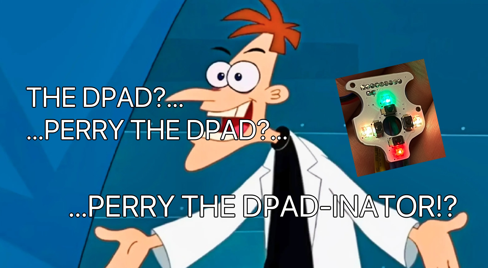
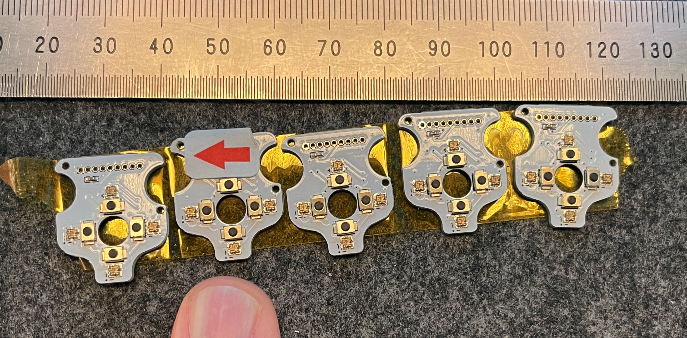
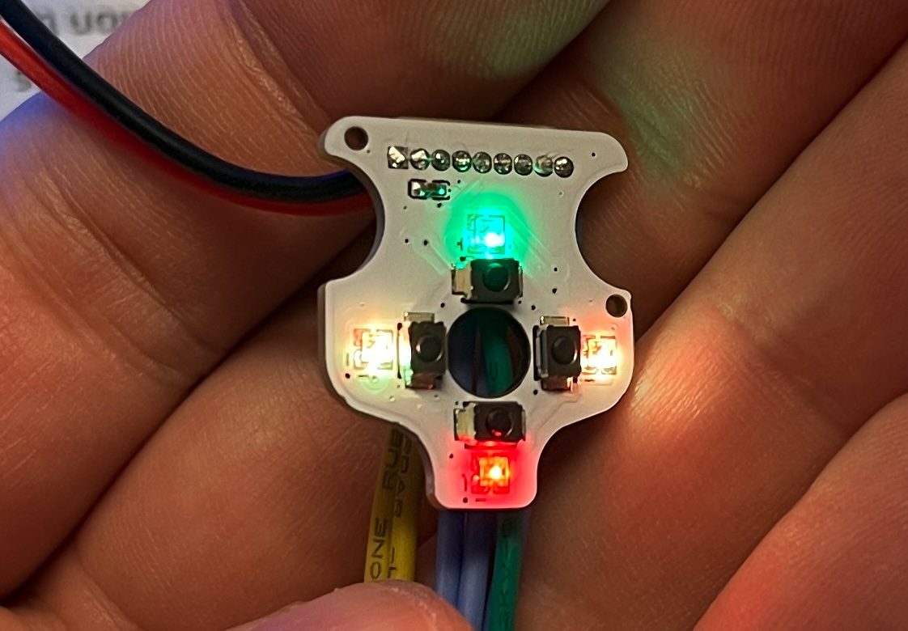
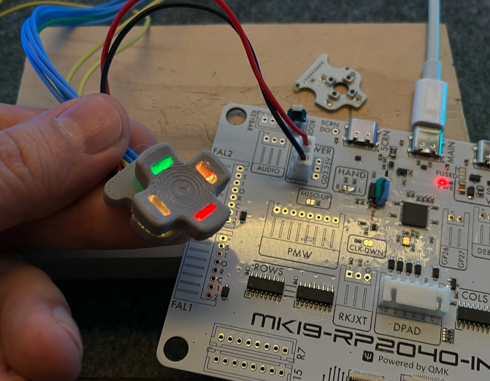

# microswitch-dpad
What if your dpad could have leds?  But also fit in a tiny area?

This is that.

# Features
- 4x addressable LEDs via DI/DO pins
- 4x Omron B3U-1000P (_no diodes; pinned as 1x shared on input side, 4x output sides e.g. 1x row, 4x col_)
  - 150gf switches cuz who reads and comprehends datasheets anyways

# dpad-inator inatoring

